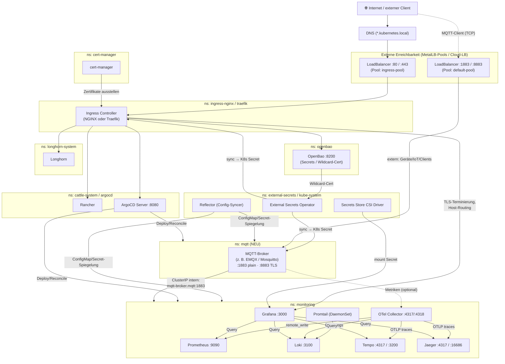
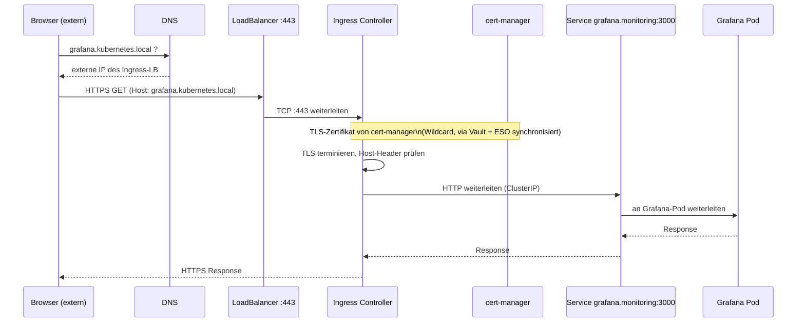
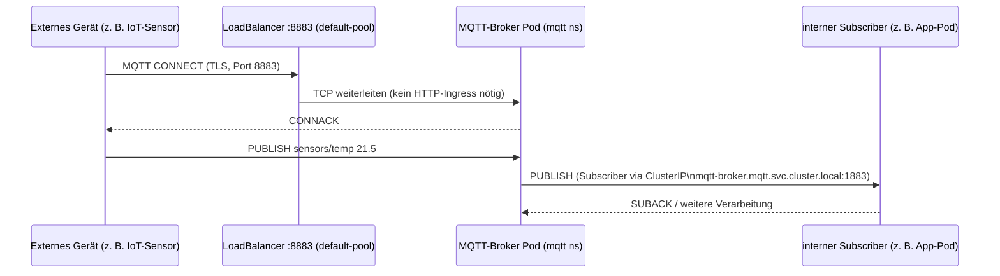

# Architektur — Komponenten & Kommunikation

Dieses Dokument zeigt die von `Install-Base.ps1` installierten Komponenten, wie sie
untereinander kommunizieren, wie ein eingehender Aufruf durch den Cluster läuft —
und wie sich **MQTT** als zusätzliche Komponente einfügen würde (sowohl intern als
auch von außerhalb des Clusters erreichbar).

> Die Diagramme sind als [Mermaid](https://mermaid.js.org/) eingebettet. In VS Code
> (Markdown-Preview), GitHub und den meisten Markdown-Renderern werden sie direkt als
> Grafik dargestellt.

---

## 1. Gesamtübersicht — Komponenten & Kommunikationswege

**Lesehinweise**

- Alle **HTTP/HTTPS-UIs** (Grafana, Rancher, ArgoCD, Longhorn, OpenBao) laufen über
  denselben Ingress-Controller → eine LoadBalancer-IP, Host-basiertes Routing,
  TLS von `cert-manager`.
- **MQTT ist kein HTTP-Protokoll** und kann daher nicht über den HTTP-Ingress laufen.
  Es bekommt einen **eigenen LoadBalancer-Service** (eigene externe IP, Pool
  `default-pool`) — analog zum bisherigen Muster, bei dem MetalLB schon zwei Pools
  vorsieht (`ingress-pool` für HTTP, `default-pool` für alles andere).
- Intern ist der Broker ganz normal per ClusterIP/DNS erreichbar
  (`mqtt-broker.mqtt.svc.cluster.local:1883`), genau wie Prometheus oder Loki.

---

## 2. Aufruf-Beispiel 1 — Browser ruft Grafana auf (HTTPS via Ingress)

---

## 3. Aufruf-Beispiel 2 — MQTT-Client (intern *und* extern)

**Zwei Zugriffspfade auf denselben Broker:**

| Aufrufer | Adresse | Port | Weg |
|---|---|---|---|
| Pod **innerhalb** des Clusters | `mqtt-broker.mqtt.svc.cluster.local` | `1883` (plain) | ClusterIP, kein Sprung über LB |
| Client **außerhalb** des Clusters | öffentliche/MetalLB-IP des `mqtt`-LoadBalancer-Service | `8883` (TLS) | LoadBalancer-Service direkt auf den Broker, **ohne** HTTP-Ingress |

TLS für `8883` nutzt dasselbe Wildcard-Zertifikat wie die übrigen Komponenten
(Vault → External Secrets Operator → K8s-Secret im `mqtt`-Namespace).

---

## 4. Namespace- und Port-Übersicht (inkl. MQTT)

| Namespace | Komponente | Port(s) | Extern erreichbar? |
|---|---|---|---|
| `ingress-nginx` / `traefik` | Ingress Controller | 80, 443 | ✅ LoadBalancer (`ingress-pool`) |
| `cert-manager` | cert-manager | – | ❌ intern |
| `openbao` | OpenBao (Vault) | 8200 | optional über Ingress |
| `external-secrets` / `kube-system` | ESO, CSI-Driver, Reflector | – | ❌ intern |
| `longhorn-system` | Longhorn | 80 (UI) | optional über Ingress |
| `cattle-system` | Rancher | 80/443 | ✅ über Ingress |
| `monitoring` | Prometheus, Loki, Tempo/Jaeger, OTel, Grafana | 9090, 3100, 4317/4318, 3200/16686, 3000 | Grafana/Prometheus/Jaeger optional über Ingress, Rest intern |
| `argocd` | ArgoCD | 8080 | ✅ über Ingress (optional) |
| **`mqtt` (neu)** | **MQTT-Broker** | **1883 (plain, intern), 8883 (TLS, intern+extern)** | **✅ eigener LoadBalancer (`default-pool`), zusätzlich ClusterIP intern** |

---

## 5. Wie würde MQTT als Komponente eingebaut werden?

**Entscheidung:** MQTT wird **nicht** Teil dieser Baseline (kein `72-mqtt` in diesem
Repo). Diese Baseline deckt nur clusterweite Infrastruktur ab (Ingress, Secrets,
Storage, Observability, GitOps) — MQTT ist anwendungsspezifisch und gehört in ein
**separates Install-Skript/Repo**, das auf einem bereits per Baseline aufgesetzten
Cluster aufbaut.

Das separate Skript würde dieselben Bausteine wiederverwenden, die die Baseline
bereitstellt, statt sie zu duplizieren:

- **Namespace**: eigener (z. B. `mqtt`), nicht Teil der Baseline-Namespaces
- **Helm-Chart**: z. B. `emqx/emqx` oder `bitnami/mosquitto`
- **Service 1 (intern)**: `ClusterIP`, Port `1883` — für Pods im Cluster
- **Service 2 (extern)**: `LoadBalancer`, Port `8883` (TLS), Annotation
  `metallb.universe.tf/address-pool: default-pool` — nutzt den von der Baseline
  bereits angelegten MetalLB-Pool, statt den HTTP-Ingress zu missbrauchen
- **TLS**: Wildcard-Zertifikat, das bereits über Vault + External-Secrets-Operator
  (Baseline-Komponenten) verteilt wird — nur zusätzlich in den `mqtt`-Namespace
  synchronisiert

Das Diagramm oben zeigt den Zielzustand konzeptionell. Die tatsächliche Umsetzung
(eigenes Skript/Repo) folgt später.
