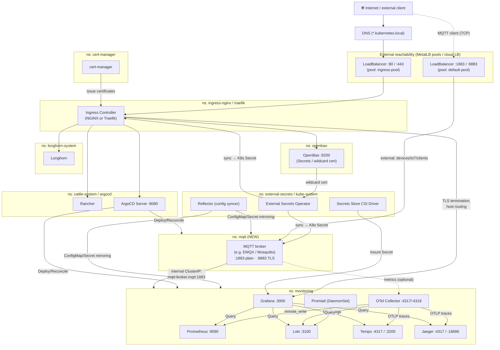
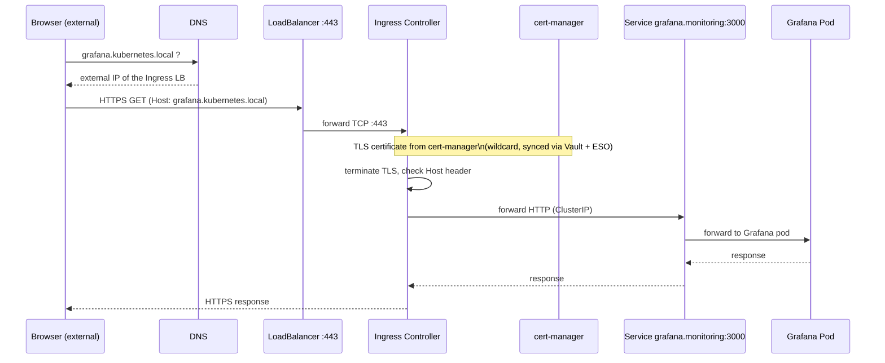
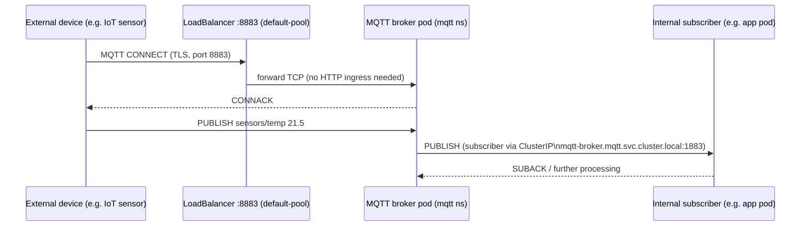

# Architecture — Components & Communication

This document shows the components installed by `Install-Base.ps1`, how they
communicate with each other, how an incoming call travels through the cluster —
and how **MQTT** would fit in as an additional component (reachable both from
inside and from outside the cluster).

> Diagrams are embedded as [Mermaid](https://mermaid.js.org/). VS Code
> (Markdown Preview), GitHub, and most Markdown renderers display them directly
> as graphics.

---

## 1. Overview — Components & Communication Paths

**How to read this**

- All **HTTP/HTTPS UIs** (Grafana, Rancher, ArgoCD, Longhorn, OpenBao) run behind
  the same Ingress Controller → one LoadBalancer IP, host-based routing,
  TLS from `cert-manager`.
- **MQTT is not an HTTP protocol**, so it can't run over the HTTP Ingress.
  It gets its **own LoadBalancer Service** (its own external IP, pool
  `default-pool`) — following the existing pattern where MetalLB already
  provides two pools (`ingress-pool` for HTTP, `default-pool` for everything else).
- Internally the broker is reachable like any other service via ClusterIP/DNS
  (`mqtt-broker.mqtt.svc.cluster.local:1883`), exactly like Prometheus or Loki.

---

## 2. Call example 1 — Browser calls Grafana (HTTPS via Ingress)

---

## 3. Call example 2 — MQTT client (internal *and* external)

**Two access paths to the same broker:**

| Caller | Address | Port | Path |
|---|---|---|---|
| Pod **inside** the cluster | `mqtt-broker.mqtt.svc.cluster.local` | `1883` (plain) | ClusterIP, no hop through the LB |
| Client **outside** the cluster | public/MetalLB IP of the `mqtt` LoadBalancer Service | `8883` (**mTLS**) | LoadBalancer Service straight to the broker, **without** the HTTP Ingress |

Port `8883` is **mTLS**, not just TLS: the broker presents the wildcard server
certificate (Vault → External Secrets Operator → K8s Secret in the `mqtt`
namespace, as usual), but additionally requires a **client certificate** from
every external device — mandatory for CRA/NIS2-relevant compliance requirements
around encryption and strong authentication across the cluster boundary.
How those client certificates get issued is detailed in
**[CERTIFICATES.md](CERTIFICATES.md)**.

---

## 4. Namespace & port overview (incl. MQTT)

| Namespace | Component | Port(s) | Externally reachable? |
|---|---|---|---|
| `ingress-nginx` / `traefik` | Ingress Controller | 80, 443 | ✅ LoadBalancer (`ingress-pool`) |
| `cert-manager` | cert-manager | – | ❌ internal |
| `openbao` | OpenBao (Vault) | 8200 | optional via Ingress |
| `external-secrets` / `kube-system` | ESO, CSI driver, Reflector | – | ❌ internal |
| `longhorn-system` | Longhorn | 80 (UI) | optional via Ingress |
| `cattle-system` | Rancher | 80/443 | ✅ via Ingress |
| `monitoring` | Prometheus, Loki, Tempo/Jaeger, OTel, Grafana | 9090, 3100, 4317/4318, 3200/16686, 3000 | Grafana/Prometheus/Jaeger optional via Ingress, rest internal |
| `argocd` | ArgoCD | 8080 | ✅ via Ingress (optional) |
| **`mqtt` (new)** | **MQTT broker** | **1883 (plain, internal), 8883 (mTLS, internal+external)** | **✅ own LoadBalancer (`default-pool`), plus internal ClusterIP** |

---

## 5. How would MQTT be added as a component?

**Decision:** MQTT will **not** become part of this baseline (no `72-mqtt` in
this repo). This baseline only covers cluster-wide infrastructure (ingress,
secrets, storage, observability, GitOps) — MQTT is application-specific and
belongs in a **separate install script/repo** that builds on a cluster already
provisioned by this baseline.

That separate script would reuse the building blocks the baseline already
provides instead of duplicating them:

- **Namespace**: its own (e.g. `mqtt`), not part of the baseline namespaces
- **Helm chart**: e.g. `emqx/emqx` or `bitnami/mosquitto`
- **Service 1 (internal)**: `ClusterIP`, port `1883` — for pods inside the cluster
- **Service 2 (external)**: `LoadBalancer`, port `8883` (TLS), annotation
  `metallb.universe.tf/address-pool: default-pool` — reuses the MetalLB pool the
  baseline already created, instead of repurposing the HTTP Ingress
- **Server TLS**: wildcard certificate already distributed via Vault + External
  Secrets Operator (baseline components) — just additionally synced into the
  `mqtt` namespace
- **Client mTLS**: separate PKI solution, see below

The diagram above shows the conceptual target state. The actual implementation
(its own script/repo) follows later.

---

## 6. Decision: client certificates for external MQTT clients (mTLS)

**Background:** CRA/NIS2 and similar regulations require encrypted and
strongly authenticated communication across the cluster boundary. Inside the
cluster, `cert-manager` already handles this. For clients **outside** the
cluster, something needs to issue and manage client certificates — only
PKI-capable systems (OpenBao/HashiCorp Vault) qualify, not the plain KV stores
the cloud providers offer (Azure Key Vault, AWS Secrets Manager, GCP Secret
Manager).

**Decision (2026-06-19):**
- This baseline stays unchanged — no PKI component here.
- The separate MQTT install script asks once: *"Are client certificates needed
  for external clients?"*
- **On-premise/Kind**: OpenBao is already running (baseline component
  `23-openbao`) → the MQTT script only needs to additionally enable the `pki`
  secrets engine + role on it.
- **Cloud (AKS/EKS/GKE)**: no OpenBao runs there by default → the MQTT script
  re-invokes `23-openbao/Install.ps1` from this baseline as-is, **solely** for
  the PKI function. The cloud-native KV store keeps handling ordinary secrets
  unchanged.
- HashiCorp Vault was deliberately **not** added as an alternative — identical
  PKI engine to OpenBao (OpenBao is the OSS fork of Vault), but an extra
  install path to maintain with no added benefit.

Detailed diagrams (PKI component overview, issuance flow, mTLS handshake):
**[CERTIFICATES.md](CERTIFICATES.md)**.
