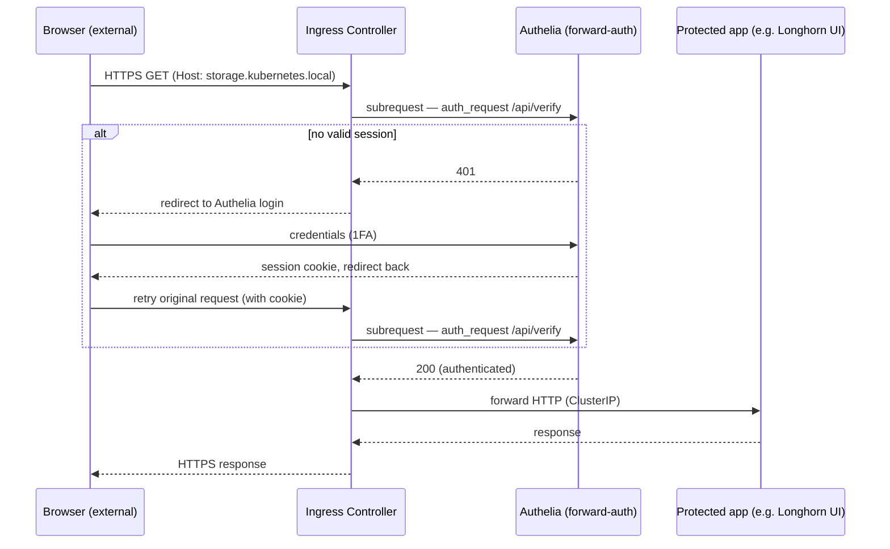
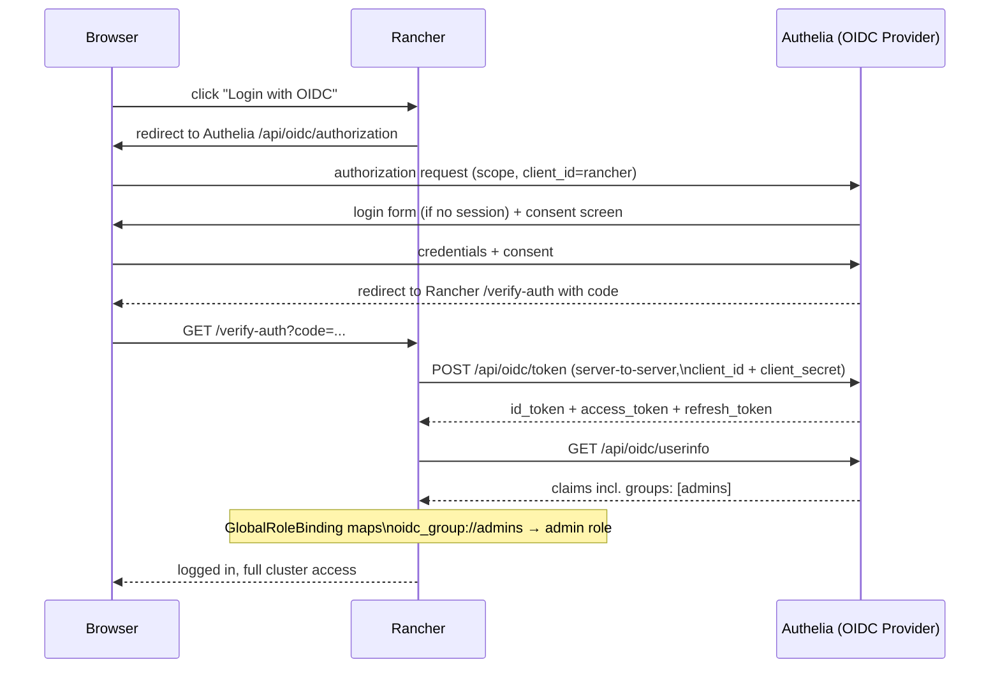
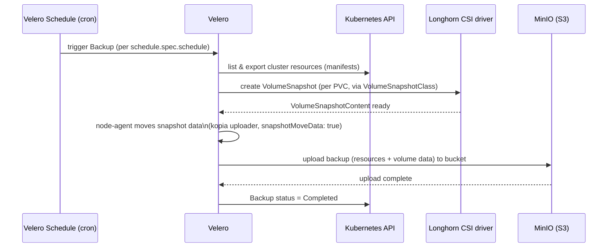

# Architecture — Components & Communication

This document shows the components installed by `Install-Base.ps1`, how they
communicate with each other, and how a few representative calls travel
through the cluster.

> Diagrams are embedded as [Mermaid](https://mermaid.js.org/). VS Code
> (Markdown Preview), GitHub, and most Markdown renderers display them directly
> as graphics.

Application-specific infrastructure that isn't part of this baseline (MQTT,
Redis, ...) is intentionally out of scope here — see the note at the bottom.

---

## 1. Overview — Components & Communication Paths

```mermaid
flowchart TB
    Internet["🌐 Internet / external client"]
    DNS["DNS (*.kubernetes.local)"]

    Internet --> DNS

    subgraph LB["External reachability (MetalLB pools / cloud LB)"]
        IngressLB["LoadBalancer :80 / :443\n(pool: ingress-pool)"]
    end

    DNS --> IngressLB

    subgraph NS_ING["ns: ingress-nginx / traefik"]
        Ingress["Ingress Controller\n(NGINX or Traefik)"]
    end

    subgraph NS_CERT["ns: cert-manager"]
        CertMgr["cert-manager"]
    end

    subgraph NS_VAULT["ns: openbao (RKE2/Kind)\nor cloud-native KV"]
        Vault["OpenBao :8200\n(KV-v2 secrets + PKI root CA)\nAzure Key Vault / AWS Secrets Manager /\nGCP Secret Manager on cloud"]
    end

    subgraph NS_AUTH["ns: authelia"]
        Authelia["Authelia :9091\nForward-auth gateway + OIDC Provider"]
    end

    subgraph NS_SUPPORT["ns: kube-system"]
        CSI["Secrets Store CSI Driver"]
        Reflector["Reflector (config syncer)"]
    end

    subgraph NS_REG["ns: registry / proxy-config"]
        Registry["Private Registry credentials\n(imagePullSecrets via Reflector)"]
        Proxy["Proxy Configuration\n(RKE2/Kind only)"]
    end

    subgraph NS_MON["ns: monitoring"]
        Prom["Prometheus :9090"]
        Loki["Loki :3100"]
        Promtail["Promtail (DaemonSet)"]
        Otel["OTel Collector :4317/:4318"]
        Tempo["Tempo :4317 / :3200"]
        Jaeger["Jaeger :4317 / :16686"]
        Grafana["Grafana :3000\n(own native login)"]
    end

    subgraph NS_MGMT["ns: cattle-system / argocd"]
        Rancher["Rancher\n(SSO via Authelia OIDC)"]
        ArgoCD["ArgoCD Server :8080"]
    end

    subgraph NS_STORE["ns: longhorn-system"]
        Longhorn["Longhorn UI\n(forward-auth via Authelia)"]
    end

    subgraph NS_BACKUP["ns: velero / minio"]
        Velero["Velero\n(cluster resources + CSI volume snapshots)"]
        Minio["MinIO :9000\n(S3-compatible backup target,\nRKE2/Kind only — internal only, no Ingress)"]
    end

    IngressLB --> Ingress
    Ingress -- "TLS termination,\nhost routing" --> Grafana
    Ingress -- "forward-auth check" --> Authelia
    Ingress --> Rancher
    Ingress --> ArgoCD
    Ingress --> Longhorn
    Ingress --> Vault
    Ingress --> Prom
    Ingress --> Jaeger
    Ingress --> Authelia

    Authelia -- "OIDC: authorize/token/userinfo" --> Rancher
    Authelia -- "forward-auth: allow/deny" --> Longhorn
    Authelia -- "forward-auth: allow/deny" --> Prom
    Authelia -- "forward-auth: allow/deny" --> Jaeger

    Vault -- "PKI: sign per-hostname certs\n(ClusterIssuer: openbao-pki)" --> CertMgr
    CertMgr -- "issue + auto-renew certificates" --> Ingress
    CSI -- "mount Secret" --> Authelia
    Reflector -- "ConfigMap/Secret mirroring" --> NS_MON
    Reflector -- "imagePullSecrets" --> Registry

    Promtail --> Loki
    Otel -- "remote_write" --> Prom
    Otel -- "OTLP logs" --> Loki
    Otel -- "OTLP traces" --> Tempo
    Otel -- "OTLP traces" --> Jaeger
    Grafana -- "Query" --> Prom
    Grafana -- "Query" --> Loki
    Grafana -- "Query" --> Tempo
    Grafana -- "Query" --> Jaeger

    ArgoCD -- "Deploy/Reconcile" --> NS_MON

    Velero -- "BackupStorageLocation (S3 API)" --> Minio
    Velero -- "VolumeSnapshot (CSI)" --> Longhorn
    Velero -- "Schedule: backs up\ncluster-wide resources" --> NS_MON
```

**How to read this**

- All **HTTP/HTTPS UIs** run behind the same Ingress Controller → one
  LoadBalancer IP, host-based routing, TLS from `cert-manager`.
- **Authelia plays two distinct roles**: it's a **forward-auth gateway** for
  apps with no login of their own (Longhorn, Prometheus, Jaeger — the Ingress
  Controller asks Authelia "is this request authenticated?" before letting it
  through), and a full **OIDC Provider** for apps that integrate properly
  (currently Rancher; more clients can register the same way via
  `Register-AutheliaOidcClient`).
- **Grafana keeps its own native login** — not yet wired to Authelia.
- **Velero/MinIO are RKE2/Kind only** today — cloud platforms aren't wired up
  yet (their native object storage would replace MinIO as the backup target).
  MinIO has no Ingress; it's purely an internal backup target.

---

## 2. Call example 1 — Forward-auth protected app (Longhorn / Prometheus / Jaeger)

The app itself (Longhorn, Prometheus, Jaeger) never sees an unauthenticated
request — nginx's `auth_request` directive blocks it at the Ingress layer
before it ever reaches the backend Service.

---

## 3. Call example 2 — Rancher SSO via Authelia (OIDC)

Rancher's OIDC client (`client_id=rancher`) is registered against Authelia by
`51-rancher/Install.ps1` via the shared `Register-AutheliaOidcClient` helper
in `_lib/Installer.Ui.psm1` — the same mechanism any future OIDC client
(e.g. Grafana) would reuse. The `groups` claim is what drives Rancher's
authorization: a `GlobalRoleBinding` with `groupPrincipalName:
oidc_group://admins` grants the `admin` role to anyone Authelia reports as a
member of the `admins` group, with no manual per-user grant needed.

---

## 4. Call example 3 — Scheduled backup (Velero)

Two things travel into MinIO per backup: the **resource manifests** (every
object in the cluster, the same data `kubectl get -A -o yaml` would show) and
the **volume data** (moved out of Longhorn's snapshot via Velero's built-in
CSI data-movement, not just a metadata-only snapshot reference — so a backup
survives losing the storage cluster itself, not only an accidental `kubectl
delete`).

---

## 5. Namespace & port overview

| Namespace | Component | Port(s) | Externally reachable? |
|---|---|---|---|
| `ingress-nginx` / `traefik` | Ingress Controller | 80, 443 | ✅ LoadBalancer (`ingress-pool`) |
| `cert-manager` | cert-manager | – | ❌ internal |
| `openbao` (RKE2/Kind) or cloud-native KV | Vault (+ PKI root CA on RKE2/Kind) | 8200 | optional via Ingress |
| `authelia` | Authelia (forward-auth + OIDC Provider) | 9091 | ✅ via Ingress |
| `kube-system` | Secrets Store CSI driver, Reflector | – | ❌ internal |
| `registry` / `proxy-config` | Private Registry credentials, Proxy Configuration | – | ❌ internal |
| `longhorn-system` | Longhorn | 80 (UI) | optional via Ingress, forward-auth via Authelia |
| `cattle-system` | Rancher | 80/443 | ✅ via Ingress, SSO via Authelia OIDC |
| `monitoring` | Prometheus, Loki, Promtail, Tempo/Jaeger, OTel, Grafana | 9090, 3100, 4317/4318, 3200/16686, 3000 | Grafana optional via Ingress (own login); Prometheus/Jaeger optional via Ingress (forward-auth); rest internal |
| `argocd` | ArgoCD | 8080 | ✅ via Ingress (optional) |
| `minio` | MinIO (Velero's backup target) | 9000 | ❌ internal only (RKE2/Kind only) |
| `velero` | Velero | – | ❌ internal (operated via `velero` CLI / `kubectl`) |

---

## Out of scope

This baseline only covers cluster-wide infrastructure (ingress, secrets,
storage, observability, GitOps, backup). Application-specific infrastructure
— **MQTT**, **Redis**, or anything else a workload needs — belongs in a
separate install script/repo that builds on a cluster this baseline already
provisioned, reusing its building blocks (Ingress/MetalLB pools, cert-manager,
Vault/OpenBao, Authelia) instead of duplicating them.

A detailed speculative design for one such case (MQTT client mTLS via
OpenBao PKI) exists in [CERTIFICATES.md](CERTIFICATES.md) — it predates this
revision and is **not implemented**, kept only as a reference for whenever
that work actually starts.
