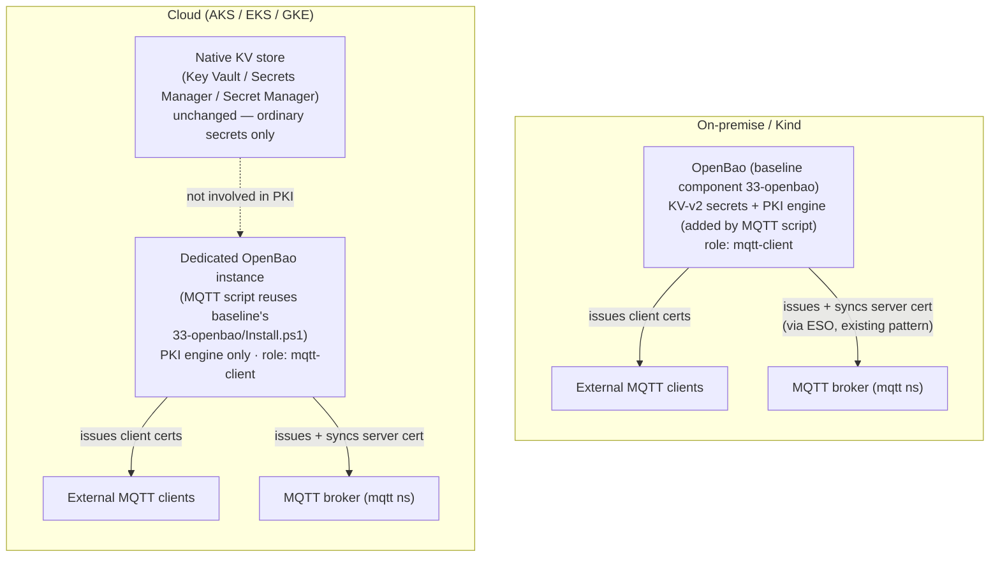
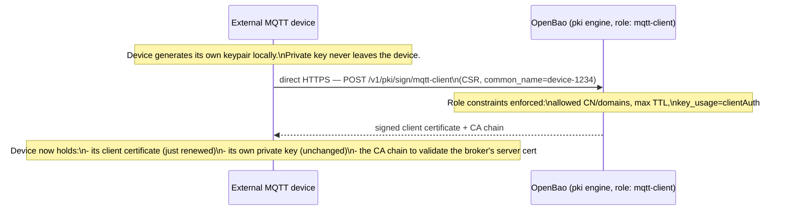
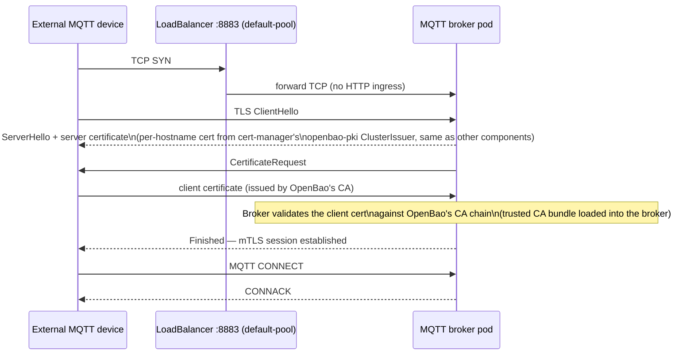

# Certificate Handling — External mTLS for MQTT Clients

This document covers **client certificate issuance** for MQTT clients that sit
outside the cluster — a speculative design for a future, separate MQTT install
script that is **not part of this baseline** and **not yet implemented**. See
[ARCHITECTURE.md](ARCHITECTURE.md) ("Out of scope" section) for why MQTT isn't
covered there.

> Diagrams are embedded as [Mermaid](https://mermaid.js.org/) — rendered
> directly as graphics in VS Code Markdown Preview, GitHub, etc.

---

## 1. Why this exists

Internal traffic is already covered: pod-to-pod and ingress TLS use
certificates issued by `cert-manager`. That doesn't help with devices that
connect to the MQTT broker from **outside** the cluster (sensors, gateways,
partner systems) — those need their own certificate, issued by something that
acts as a real Certificate Authority.

Driver: CRA/NIS2-type compliance pressure to encrypt and strongly authenticate
machine-to-machine traffic that crosses the cluster boundary. Plain TLS (server
cert only) encrypts the channel but doesn't authenticate the client — mutual
TLS (mTLS, client certificate required) closes that gap.

None of the cloud-native secret stores this baseline already uses
(Azure Key Vault, AWS Secrets Manager, GCP Secret Manager) act as a general
PKI/CA — they only store values. Only OpenBao's `pki` secrets engine does, and
it's already part of the baseline for on-prem/Kind (`33-openbao`).

---

## 2. Component overview — where the CA lives per platform

**Key point:** on cloud platforms, OpenBao is deployed a **second time**
purely for PKI duty — it does not replace the native KV store the baseline
already picked for that platform. Two backends run side by side, each doing
the job it's actually good at.

---

## 3. Certificate issuance & renewal flow (CSR-based, device-initiated)

**Decision:** the device generates its own keypair and only ever sends a
**CSR** (Certificate Signing Request — public key + identity, no secret
material) to OpenBao. OpenBao signs it and returns the certificate. The
private key never leaves the device and never appears as a Kubernetes Secret
in the cluster.

This was chosen over the alternative — OpenBao/cert-manager generating the
keypair centrally and pushing it to the device — because the push model means
the device's private key briefly sits in a Kubernetes Secret (etcd, only
base64-encoded by default) and crosses the network in cleartext key form. The
CSR model avoids that exposure entirely and works as long as the device can
generate an RSA/EC keypair locally, which is true for virtually anything
capable of speaking MQTT-over-TLS in the first place.

The OpenBao **role** (`mqtt-client`) is the actual policy object here — it
defines who is allowed to request a cert and with what constraints (allowed
CNs/domains, max TTL, forced `clientAuth` key usage so the cert can't be
misused for anything else). The device authenticates to OpenBao using its
**current still-valid certificate** for routine renewal (see §5 for what
happens once it's no longer valid).

**Important:** this HTTPS call goes **directly to OpenBao**, not through the
MQTT broker/LoadBalancer on :8883. If renewal depended on the same mTLS
channel that an expired certificate just broke, the device could never get
back in — a chicken-and-egg problem. The renewal path must stay reachable
independently of MQTT connectivity.

---

## 4. mTLS handshake at connection time

The broker needs the OpenBao CA chain loaded as a **trusted CA bundle** (not
just its own server cert) so it can verify client certificates during the
handshake — this is the one extra piece of broker configuration beyond what a
plain TLS-only setup needs.

---

## 5. Identity stability & certificate lifetime

**Identity stays fixed, key material rotates.** A device's Common Name / SAN
(its device ID) is permanent and used for broker-side authorization (ACLs on
which topics a given identity may publish/subscribe to). What changes on
every renewal is the keypair and the certificate's serial number/validity
window — that rotation is the actual security benefit of renewing often.

**Lifetime — starting point:** devices are normally reachable continuously,
worst case offline over a weekend (~3 days). Recommended default:

- **TTL: 14 days**, renewal attempted starting at **day 7** (50% of validity)
- Gives a full week of slack after the renewal point even if one renewal
  attempt is missed — comfortably covers a missed weekend with margin to
  spare

Short-lived certs are cheap here because OpenBao is a self-operated CA with
no issuance cost or rate limit (unlike a public CA). The shorter the TTL, the
less you depend on revocation (CRL/OCSP) working at all — many embedded
MQTT/TLS stacks don't implement revocation checking, so "let it expire" is
often the only reliable way to cut a device off.

Adjust the 14-day default once real-world connectivity patterns are known;
treat it as an initial assumption, not a hard requirement.

---

## 6. Long-term offline / defective devices — expiry is intentional

The 14-day TTL is deliberately **not** sized to cover a device that's broken
and offline for weeks or months. When such a device returns and its
certificate has expired, it should fail to reconnect — that's the desired
behavior, not a gap to engineer around. A device with unknown state after an
extended, unmonitored absence shouldn't silently regain trust with a
long-dormant credential.

This means a returning device needs a **re-enrollment** step, not a renewal —
renewal only works because the device authenticates with its still-valid
current certificate; a device with an expired certificate has nothing left to
authenticate with. Re-enrollment needs a different bootstrap trust mechanism,
the same one used for a device's very first certificate ever. See §7.

---

## 7. Open question — initial enrollment / bootstrap trust

**Not yet decided — deliberately left open** until it's clear how device
provisioning will actually happen operationally. This is the missing piece
for both a brand-new device's first certificate and a long-offline device's
re-enrollment after expiry (§6).

Candidates discussed, none committed to yet:

- **Per-device one-time token** (OpenBao AppRole, RoleID+SecretID,
  ideally response-wrapped/single-use) — fully automatable, no special
  hardware required; leading candidate given the rest of this design is
  already OpenBao-centric and automation-first.
- **Manufacturer-embedded device identity** (IEEE 802.1AR / TPM-backed) —
  strongest guarantee, but only viable if the hardware already supports a
  secure element; not assumed here.
- **Manual operator approval** — most control, doesn't scale, and cuts
  against this project's general preference for fully scripted, hands-off
  operation; possibly still worth reserving specifically for the rare
  long-offline re-enrollment case (§6) even if routine first-enrollment is
  automated.
- **Trusted installation-time network/channel** — trust derived from a
  controlled provisioning step at install/repair time, usually combined with
  one of the above rather than standing alone.

Revisit this section once the device provisioning process is defined.

---

## 8. Platform summary

| Platform | CA for client certs | Extra deployment needed? | Ordinary secrets backend (unchanged) |
|---|---|---|---|
| RKE2 / Kind (on-prem) | OpenBao (`33-openbao`, already running) | No — just enable `pki` engine + role | OpenBao (same instance) |
| AKS | Dedicated OpenBao (PKI only) | Yes — MQTT script runs `33-openbao/Install.ps1` | Azure Key Vault |
| EKS | Dedicated OpenBao (PKI only) | Yes — MQTT script runs `33-openbao/Install.ps1` | AWS Secrets Manager |
| GKE | Dedicated OpenBao (PKI only) | Yes — MQTT script runs `33-openbao/Install.ps1` | GCP Secret Manager |

**Considered and rejected:** native cloud PKI services (AWS Private CA, GCP
Certificate Authority Service) and HashiCorp Vault. Native cloud PKI would mean
three different implementations with no Azure equivalent; HashiCorp Vault has
the identical PKI engine to OpenBao (OpenBao is its OSS fork) but adds a
parallel install path to maintain for no functional gain.

---

## 9. Not yet implemented

Everything above is the target architecture for the **separate MQTT install
script** (see the "Out of scope" note in [ARCHITECTURE.md](ARCHITECTURE.md) for
why MQTT isn't part of this baseline). The baseline's `33-openbao` already
enables the `pki` engine and
a root CA on RKE2/Kind (for ingress certs, via cert-manager's `openbao-pki`
ClusterIssuer) — but nothing in this repository yet writes the dedicated
`mqtt-client` role, or deploys a second OpenBao instance on cloud platforms;
that's still the design to build against once the MQTT script is started.
Enrollment/bootstrap (§7) is still open and needs to be resolved before this
can be built end-to-end.
