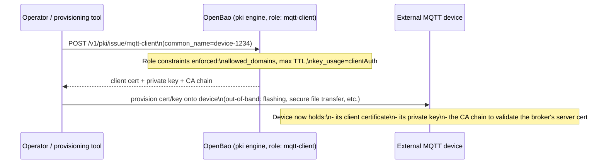
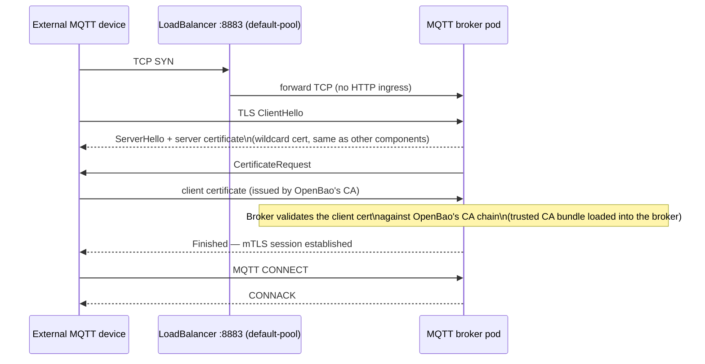

# Certificate Handling — External mTLS for MQTT Clients

This document covers **client certificate issuance** for MQTT clients that sit
outside the cluster — the part that doesn't fit in [ARCHITECTURE.md](ARCHITECTURE.md)
section 6. See that document first for the overall MQTT placement decision
(separate install script, not part of this baseline).

> Diagrams are embedded as [Mermaid](https://mermaid.js.org/) — rendered
> directly as graphics in VS Code Markdown Preview, GitHub, etc.

---

## 1. Why this exists

Internal traffic is already covered: pod-to-pod and ingress TLS use
certificates issued by `cert-manager`. That doesn't help with devices that
connect to the MQTT broker from **outside** the cluster (sensors, gateways,
partner systems) — those need their own certificate, issued by something that
acts as a real Certificate Authority.

Driver: CRA/NIS2-type compliance pressure to encrypt and strongly authenticate
machine-to-machine traffic that crosses the cluster boundary. Plain TLS (server
cert only) encrypts the channel but doesn't authenticate the client — mutual
TLS (mTLS, client certificate required) closes that gap.

None of the cloud-native secret stores this baseline already uses
(Azure Key Vault, AWS Secrets Manager, GCP Secret Manager) act as a general
PKI/CA — they only store values. Only OpenBao's `pki` secrets engine does, and
it's already part of the baseline for on-prem/Kind (`23-openbao`).

---

## 2. Component overview — where the CA lives per platform

**Key point:** on cloud platforms, OpenBao is deployed a **second time**
purely for PKI duty — it does not replace the native KV store the baseline
already picked for that platform. Two backends run side by side, each doing
the job it's actually good at.

---

## 3. Client certificate issuance flow

The OpenBao **role** (`mqtt-client`) is the actual policy object here — it
defines who is allowed to request a cert and with what constraints (allowed
CNs/domains, max TTL, forced `clientAuth` key usage so the cert can't be
misused for anything else). Per-device identity comes from the certificate's
Common Name / SAN, not from a shared secret.

---

## 4. mTLS handshake at connection time

The broker needs the OpenBao CA chain loaded as a **trusted CA bundle** (not
just its own server cert) so it can verify client certificates during the
handshake — this is the one extra piece of broker configuration beyond what a
plain TLS-only setup needs.

---

## 5. Platform summary

| Platform | CA for client certs | Extra deployment needed? | Ordinary secrets backend (unchanged) |
|---|---|---|---|
| RKE2 / Kind (on-prem) | OpenBao (`23-openbao`, already running) | No — just enable `pki` engine + role | OpenBao (same instance) |
| AKS | Dedicated OpenBao (PKI only) | Yes — MQTT script runs `23-openbao/Install.ps1` | Azure Key Vault |
| EKS | Dedicated OpenBao (PKI only) | Yes — MQTT script runs `23-openbao/Install.ps1` | AWS Secrets Manager |
| GKE | Dedicated OpenBao (PKI only) | Yes — MQTT script runs `23-openbao/Install.ps1` | GCP Secret Manager |

**Considered and rejected:** native cloud PKI services (AWS Private CA, GCP
Certificate Authority Service) and HashiCorp Vault. Native cloud PKI would mean
three different implementations with no Azure equivalent; HashiCorp Vault has
the identical PKI engine to OpenBao (OpenBao is its OSS fork) but adds a
parallel install path to maintain for no functional gain.

---

## 6. Not yet implemented

Everything above is the target architecture for the **separate MQTT install
script** (see the placement decision in [ARCHITECTURE.md](ARCHITECTURE.md)
section 5). Nothing in this repository currently enables the `pki` engine,
writes the `mqtt-client` role, or deploys a second OpenBao instance on cloud
platforms — this is the design to build against once that script is started.
